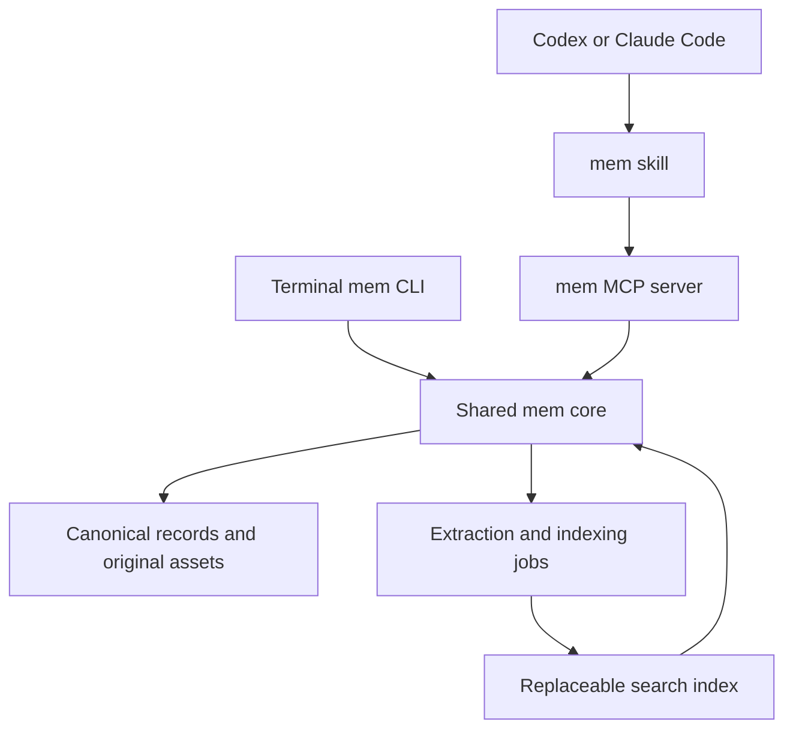

# mem: product and implementation plan

Draft date: September 10, 2026

Status: local prototype implemented. The proposal below preserves the original direction; the progress table and linked implementation notes identify changes and unfinished acceptance criteria.

## Implementation progress

| Milestone | Current state |
| --- | --- |
| Retrieval experiment | SQLite FTS5 + local MiniLM implemented and measured on 100 synthetic records / 30 queries. QMD was not benchmarked; see the [backend decision](docs/ARCHITECTURE.md). |
| Durable core and CLI | Notes, URL text snapshots, copied files, retrieval, retries, deletion, reindex, export/import implemented. Restart and concurrent-write tests pass. |
| Cross-agent integration | MCP server, user-scope setup, and both skills implemented. Fresh-server SDK integration tested; real Codex/Claude interactive acceptance is pending. |
| Capture quality | Descriptions support image recall; automatic OCR/vision, PDF text extraction, and browser-assisted capture remain pending. |
| Public release | Source and local package ready for review. Fresh install, platform CI, public naming/license, and GitHub/npm publication remain pending. |

See [README.md](README.md) for implemented commands and [validation results](docs/VALIDATION.md) for measured results and limitations. The synthetic recall result does not establish the broader real-world acceptance target below.

## 1. Objective

Build a lightweight standalone tool that can be developed and published on GitHub. A user can save a website bookmark, random note, image, or useful excerpt from any local Codex or Claude Code session, then retrieve the original from a different session using a vague natural-language description.

The central promise is durable capture and useful recall. The collection belongs to the user and survives closing a session, changing repositories, and switching agents.

The first version targets one user on one Mac. Linux compatibility should influence implementation choices, but Linux support is a release claim only after testing. Multi-device access is a later phase.

## 2. Intended experience

The intended interface is illustrated below. Consult README for the current exact syntax and image-description requirements:

```text
# Claude Code skill
/mem store https://example.com/article -- useful for my queue project
/mem store Idea: compare pricing pages using weekly screenshots
/mem store /absolute/path/to/dashboard.png
/mem retrieve that article about making background jobs reliable

# Codex skill
$mem store ...
$mem retrieve ...

# Direct shell interface
mem store "A thought I want to remember"
mem store https://example.com/article --note "For the queue project"
mem store /absolute/path/to/dashboard.png --note "Design inspiration"
mem retrieve "the dark dashboard with orange charts"
mem get <id>
mem status
mem export <destination>
```

The CLI has deterministic input parsing and machine-readable output. The agent skills interpret conversational requests and translate them into tool calls. A slash command is an agent interface, not a shell command.

After a save, return a durable item ID, what was preserved, and extraction/indexing status. Never say an item is fully indexed if only its original was saved.

Search results contain a title, stable ID, source link or original asset reference, save time, supporting excerpt, and a short reason for the match. The agent may inspect promising results and refine the query. Weak matches and absent results must remain explicit.

## 3. Existing projects and reuse decision

Capabilities below reflect the documentation reviewed for this proposal. Recheck the chosen versions during implementation.

| Project | Relevant capabilities | Assessment |
| --- | --- | --- |
| [Karakeep](https://github.com/karakeep-app/karakeep) | Links, notes, images, PDFs, OCR, archival, browser extensions, CLI and MCP | Closest complete product; useful as a capture/retrieval reference and comparison baseline. A larger application stack than the intended utility. |
| [QMD](https://github.com/tobi/qmd) | Local keyword and semantic search, reranking, CLI, SDK and MCP | Preferred search component for the first experiment. Capture, original-asset preservation, and product workflow remain our responsibility. |
| [Basic Memory](https://github.com/basicmachines-co/basic-memory) | Markdown storage, MCP read/write tools, SQLite index, semantic search and optional reranking | Strong alternative if editable notes and Obsidian compatibility become the main focus. |
| [Supermemory local](https://supermemory.ai/docs/self-hosting/overview) | Local memory server, hybrid search, file ingestion, coding-agent integrations | Alternative backend worth evaluating if extraction and ingestion dominate the work. Local API/plugin support differs from the hosted MCP offering. |
| [Mem0](https://github.com/mem0ai/mem0) | Persistent agent memory, SDKs and self-hosting options | Useful reference for agent memory; less directly aligned with preserving and finding original personal artifacts. |

Karakeep's 0.33 release exposes semantic and hybrid search through the API, MCP, and CLI, with those modes labeled experimental. Its documented MCP creation tool handles text and URLs; its CLI also uploads image/PDF assets. See [release notes](https://github.com/karakeep-app/karakeep/releases/tag/v0.33.1), [MCP documentation](https://docs.karakeep.app/integrations/mcp/), and [CLI skill](https://github.com/karakeep-app/karakeep/blob/main/skills/SKILL.md).

QMD's full default pipeline documents approximately 2 GB of model downloads. A local tool is not automatically small or quick to start. Test a keyword-plus-embedding path first, with the host agent handling query refinement and final candidate selection. Make extra local generation and reranking models optional. See [QMD requirements](https://github.com/tobi/qmd#requirements).

Decision: prototype against QMD through a narrow adapter. Do not fork it initially or couple the canonical storage format to its index. Compare retrieval quality, installation friction, cold-start time, memory use, and incremental indexing before adopting it permanently. If its footprint is unsuitable, evaluate a smaller embedding provider and SQLite-backed retrieval implementation behind the same adapter.

QMD currently identifies its repository license as MIT; Karakeep and Basic Memory identify theirs as AGPL-3.0. Inspect the exact dependency and model licenses before distributing them. Proposed license for our original implementation: MIT, to be selected before public release.

## 4. Architecture



Use TypeScript for the initial CLI, MCP adapter, and core, subject to the dependency experiment. The installation must not require Docker. Do not promise a single executable until packaging has been tested.

The CLI and MCP server call the same core operations. The skills contain workflow instructions rather than a second implementation of storage logic.

Keep one explicitly configured personal data directory outside project repositories. Do not infer the active collection from the current Git checkout. Optional project/source labels provide context without partitioning search by default.

### Canonical data and derived indexes

Store originals as files and retain portable Markdown/JSON records. Use a small SQLite catalog for IDs, metadata, job state, and attachment references. Define ownership clearly: supported edits go through the core API in v1; arbitrary external file editing is not a promised synchronization feature yet.

Each item includes:

- Stable ID, content type, schema version, capture timestamp, and source.
- Exact user text or original URL and preserved asset bytes.
- User-provided reason for saving it; optional source project and conversation reference.
- Extracted text, generated description, and summary as separate fields with provenance.
- Content hash, attachment references, extraction status, indexing status, and errors.
- Index/model version information sufficient to trigger a rebuild.

Generated summaries must never replace original content. Copy local assets into the collection so deleting the source screenshot does not destroy the memory. Normalize URLs cautiously; preserve the supplied URL and do not strip parameters that may identify distinct content.

Use atomic file writes and transactional metadata updates. Serialize index-writing jobs across clients with an explicit lock/worker mechanism. A successful store response means durable original storage; the index can be pending and must be reconstructible.

### Proposed MCP tools

| Tool | Responsibility |
| --- | --- |
| `mem_store` | Save text, a URL, or a permitted local file with optional context; return ID and status. |
| `mem_search` | Search the shared collection with natural-language text and optional filters; return bounded candidates and excerpts. |
| `mem_get` | Retrieve one original record or bounded content by ID. |
| `mem_status` | Report pending/failed extraction and indexing work. |
| `mem_delete` | Remove an explicitly identified item and associated derived data. |

Keep bulk import, export, repair, and reindex operations in the CLI initially. Supply read-only/destructive MCP annotations as appropriate, while enforcing actual access rules in the application.

Register the MCP connection and skill at user scope in both clients. Codex documents `$name` and `/skills`; Claude Code supports `/name` and arguments. See [Codex skills](https://learn.chatgpt.com/docs/build-skills), [Codex MCP](https://learn.chatgpt.com/docs/extend/mcp?surface=cli), [Claude skills](https://code.claude.com/docs/en/skills), and [Claude MCP](https://code.claude.com/docs/en/mcp).

## 5. Capture and retrieval pipeline

### Capture

1. Persist the original input and context immediately.
2. For URLs, attempt readable-page extraction. On failure, retain the bookmark and report the failure. Authentication-required pages need explicit user-provided content or a later browser integration.
3. For images, preserve bytes, extract visible text, and optionally produce a visual description. Label generated descriptions.
4. Split long extracted content for indexing while retaining the parent item ID.
5. Update keyword search and embeddings through resumable jobs; expose progress and retries.

Image descriptions enable queries such as “dark dashboard with orange charts.” OCR alone does not. Direct image embeddings are a later addition if evaluation demonstrates that descriptions lose important visual cues.

Start with absolute file paths. A pasted image that the host model can see is not necessarily accessible to an MCP process. Treat attachment transfer and clipboard capture as separate capabilities to validate in each client.

### Retrieval

1. Search exact terms and semantic similarity.
2. Combine rankings, deduplicate chunks into source items, and return a bounded candidate set.
3. Apply explicit type/date/source filters. Treat dates inferred from vague language as uncertain and relax them if necessary.
4. Let the agent read promising records and refine the query within a bounded number of searches.
5. Present likely originals with supporting evidence. Ask a distinguishing question if several remain plausible.

Direct CLI search must also work without a host agent. It can return ranked results without generating a conversational answer.

Store-time context is a key product feature: “useful for my future apartment” may be more memorable than the page title. Search both the content and why it mattered to the user.

## 6. Model and data boundaries

The host agent interprets intent, expands vague queries, examines candidates, and explains matches. The memory tool owns storage and indexing. Background work cannot depend on an open Codex or Claude session.

Prefer local embeddings initially. Any optional external embedding or vision service requires explicit provider configuration. Do not assume a coding-agent subscription supplies a general API credential.

Local storage does not imply fully offline use: content returned to Codex or Claude enters that agent's model context. Explain this accurately in documentation and keep tool responses bounded.

Treat saved pages as untrusted content, not instructions. Limit URL fetches to permitted destinations, validate redirects, and impose size/time limits. Restrict local-file capture to configured roots or explicitly supplied permitted paths. Never execute imported content.

Explicit `store` requests authorize saving the identified material; do not silently archive entire conversations. Keep secrets, private collections, model caches, and evaluation data out of the software repository. Test deletion across originals, catalog entries, and search indexes.

## 7. Implementation milestones

### Milestone 1: retrieval and packaging experiment

Create approximately 100 representative items and 30 deliberately vague queries. Use public/synthetic fixtures initially; keep any later personal corpus separate. Compare keyword-only retrieval with QMD semantic/hybrid paths. Measure cold/warm performance, model downloads, memory consumption, and incremental indexing.

Exit criterion: document the chosen backend and tradeoffs based on measurements. Do not adopt vendor benchmark numbers as our own expected results.

### Milestone 2: durable core and CLI

Implement store, retrieve, get, status, delete, export, and reindex. Support notes, accessible URLs, and common image files, with explicit indexing states. Add content hashing, original preservation, and resumable jobs.

Exit criterion: save content, close the process, and retrieve the same original after restart. Rebuild the search index from preserved records. Distinguish extraction/indexing failures from storage failures.

### Milestone 3: cross-agent integration

Expose the shared core through MCP. Add personal skills for Claude Code and Codex. Provide setup and diagnostics that report executable paths, collection path, tool connectivity, and index health.

Exit criterion: save from Claude Code in repository A and retrieve from a fresh Codex session in repository B. Test the reverse direction and simultaneous saves. Verify both clients use the same collection.

### Milestone 4: capture quality and reliability

Add OCR and optional image descriptions, bookmark HTML import, bounded content previews, retry controls, and a tested backup/restore workflow. Validate duplicate URLs/files, very long pages, broken links, and concurrent writes.

Exit criterion: no lost originals in restart/concurrency tests, reliable source links in results, and understandable partial-failure behavior.

### Milestone 5: public release

Choose a package/repository name after checking availability. Pin tested dependencies, settle the original-code license, document provider/model requirements, add CI and release packaging, and provide an executable quickstart with sample data.

Exit criterion: a fresh user can install and complete the cross-agent workflow without editing source code. Publish measured limitations and supported operating systems.

## 8. Evaluation and acceptance criteria

The corpus should include notes, web pages, screenshots, visually described pictures, similar-looking distractors, and long documents. Queries should include exact names, paraphrases, incorrect time recollections, visual descriptions, and no-match cases. Include multilingual examples if multilingual use becomes a requirement; do not infer language preferences from the user's name.

Proposed initial target: the intended item appears in the first five results for at least 85% of answerable evaluation queries. This is an acceptance target, not an achieved result. Report keyword baseline, semantic results, and agent-assisted results separately.

Also measure:

- Time to durable save and time until searchable.
- Cold-start and warm-search latency on documented hardware.
- Memory use, disk growth, and initial model download size.
- Correct source/asset recovery and duplicate behavior.
- Restart, concurrent-write, deletion, export/restore, and reindex correctness.
- Behavior when the model provider or extraction network request fails.
- No-match handling and unsupported claims in agent-presented results.

Test prompt-injection content and disallowed file/network access as application boundaries, not solely as prompt instructions.

## 9. Deferred scope and open decisions

Defer multi-device sync, a hosted service, team sharing, automatic conversation capture, a browser extension, a graphical collection browser, audio/video transcription, and direct image-vector search until the basic workflow is useful.

Decisions to resolve during implementation:

1. Does QMD meet installation and resource targets, or should the search adapter use a smaller implementation?
2. What local OCR/vision path works well on the target Mac, and which optional provider integrations are worthwhile?
3. Which attachment mechanisms are available in the tested versions of each agent?
4. What public package/repository name is available?
5. Is MIT the desired license for the original implementation?

The first useful deliverable is a working, durable, cross-agent capture-and-recall loop. Expand only after testing it on things the user actually struggles to remember.
