# Memlio

<p align="center"></p>

A personal memory for Claude Code, Codex, and GitHub Copilot CLI. Save a bookmark, note, or picture from inside the agent, or the page you are looking at in Chrome; find it later, from any project or session, by describing what you remember.

Everything stays on your machine: SQLite records, copies of saved files, a keyword index, and a small local embedding model for natural-language search. No accounts, no cloud, no API keys. A `memlio` command line is included for scripting and backups.

**Status:** early release, MIT-licensed. Tested on macOS with Node 24; Linux is expected to work; Windows is untested.

## Install

Requires Node.js 22.13 or newer. See [docs/SETUP.md](docs/SETUP.md) if you need to install Node first.

```sh
npm install -g @yanggao7/memlio
memlio setup claude     # and/or: memlio setup codex, memlio setup copilot
```

`setup` registers the MCP server and the `/memlio` skill with the agent and downloads the 23 MB embedding model once. Restart the agent afterward.

To run from a checkout instead: `pnpm install --frozen-lockfile && pnpm build`, then use `node dist/cli.js` in place of `memlio`.

## Use

From Claude Code (`/memlio`), Codex (`$memlio`), or Copilot CLI (`/memlio`):

```text
/memlio https://example.com/article why this page matters to me
/memlio /absolute/path/to/dashboard.png dark dashboard with orange charts
/memlio A thought I want to keep
/memlio [paste a screenshot] competitor pricing page
/memlio find that article about background jobs
/memlio status
/memlio delete m_9c21
```

| `/memlio ...`                           | What happens                                                                                                                                         |
| --------------------------------------- | ---------------------------------------------------------------------------------------------------------------------------------------------------- |
| a URL, path, text, or pasted screenshot | Saves it. Any remaining words become your note. `store` may be written first but is not required.                                                    |
| `find <description>`                    | Searches the shared collection, reads the likely matches, and answers with the original plus excerpts. Weak or missing matches are reported as such. |
| `status`                                | Reports how many items are saved and any capture or indexing failures.                                                                               |
| `get <id>`                              | Shows one saved record.                                                                                                                              |
| `delete <id>`                           | Removes one record and its file if nothing else uses it.                                                                                             |

From Chrome, once the extension is loaded (see below): click the toolbar button or press Alt+Shift+M, add a note, and save. The page text comes from the tab as you see it, so pages behind a login work. Tick the checkbox to keep a screenshot of the visible area as well.

The same collection from a terminal. No setup is needed for this: the first command creates the collection and downloads the model.

```sh
memlio store "Try weekly screenshots of competitor pricing"
memlio store https://example.com/article --note "For my queue project"
memlio find "competitor pricing"
memlio status
```

## Chrome extension

```sh
memlio setup chrome
```

This registers a native messaging host so the extension can reach your collection. Then open `chrome://extensions`, turn on Developer mode, choose "Load unpacked", and pick the `extension` folder that setup prints. Everything saved from Chrome lands in the same collection the agents search. Details and troubleshooting are in [docs/SETUP.md](docs/SETUP.md#chrome-extension).

## Good to know

- **Bookmarks** saved from an agent or the terminal are fetched once for a readable text snapshot. Login-only, JavaScript-only, and bot-protected pages cannot be captured that way; the bookmark is still saved and your note stays searchable. Saving from the Chrome extension uses the page as rendered in your browser instead.
- **Files** are copied, so deleting the original does not lose the memory. Text is extracted from `.txt`, `.md`, `.csv`, and `.json`. Images and PDFs rely on the description you give them; there is no OCR.
- **Saving files from the agent** needs permission: `memlio setup claude --allow-path ~/Screenshots`. The terminal command can save any file you name.
- **Pasted screenshots** are saved from the system clipboard. Paste the image into the prompt and send `/memlio` with an optional reason; the agent describes what it sees so you can find it later. From a terminal, copy a screenshot (Cmd+Ctrl+Shift+4 on macOS) and run `memlio store --clipboard --description "..."`. Linux needs `wl-paste` or `xclip`.
- **Saving the same thing twice** with the same note returns the existing item. A different note creates a second item. A repeat save from Chrome fills in the page text or screenshot the item was missing, which is how to complete a bookmark the server could not capture.
- **Search** combines keyword and semantic matching. If the model is missing, search still works on keywords and says so.
- **Data** lives in `~/.local/share/memlio`. Back it up, or move it to another machine, with `memlio export <new-dir>` and `memlio import <dir>`. `memlio repair` retries failed captures and rebuilds the search index.

More detail: [setup and troubleshooting](docs/SETUP.md), [how storing and search work](docs/WORKFLOWS.md), [architecture decisions](docs/ARCHITECTURE.md), [validation results](docs/VALIDATION.md), and the [original plan](PLAN.md).

## Development

```sh
pnpm test                                        # builds, then runs the suite without the model
MEMLIO_MODEL_CACHE=~/.local/share/memlio/models pnpm test   # also runs the real-model test
pnpm check                                       # types and formatting
```

## License

[MIT](LICENSE).
