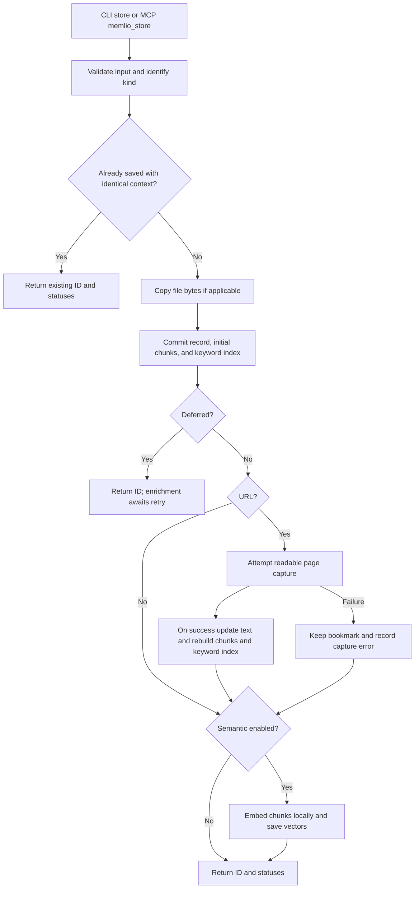
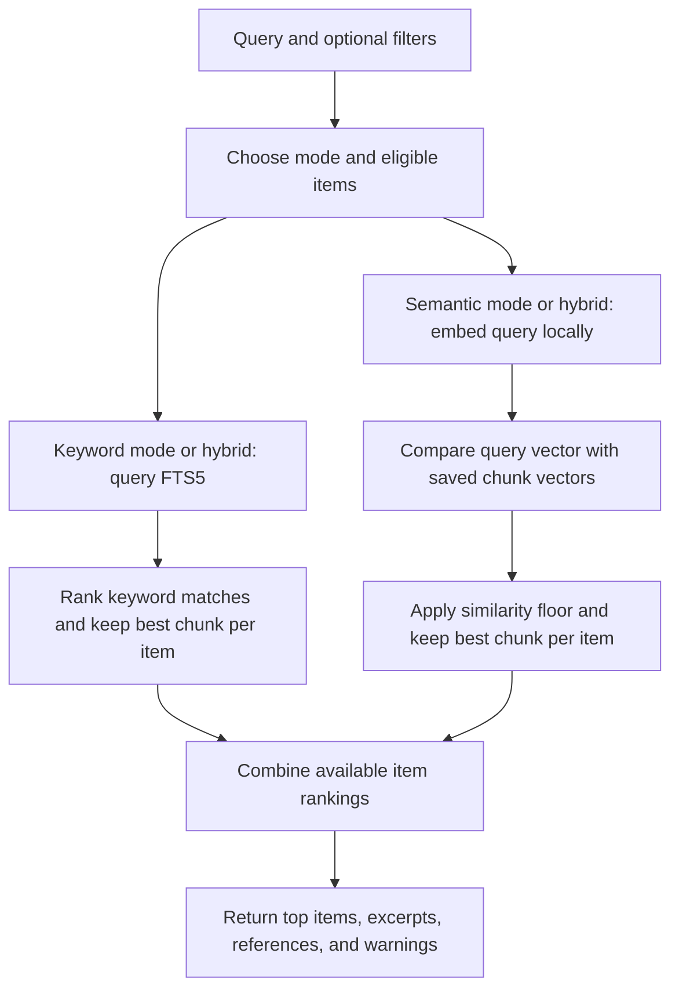
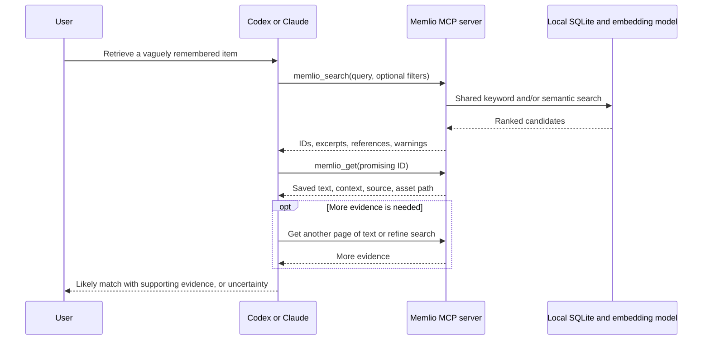

# How Memlio stores and retrieves memories

This document describes the current TypeScript prototype, updated for semantic search enabled by default. It separates implemented behavior from planned work. For setup commands, see the [README](../README.md); for design rationale, see [architecture decisions](ARCHITECTURE.md).

**Saving always builds a keyword index. Semantic embeddings are enabled by default and can be explicitly disabled.** The CLI and MCP server share one storage/search implementation. Codex or Claude adds reasoning around the tools; Memlio itself does not run a generative agent.

## The pieces

| Piece | What it does |
| --- | --- |
| Original record | Preserves the input, context, timestamps, capture status, and extracted text in SQLite. Original file bytes are copied into `assets/`. |
| Chunk | A small, overlapping slice of text, prefixed with the item's title and context. One item can have many chunks. |
| Keyword index | SQLite FTS5 records which terms occur in each chunk and ranks matching text. It works without a model. |
| Embedding | A numerical representation of a chunk's text, used to find similar meanings even when wording differs. |
| Agent | Interprets the user's request, calls tools, reads candidates, and explains the evidence. It runs in the host client. |

## 1. What happens after `memlio store`

For example:

```sh
memlio store https://example.com/article --note "Useful for my background-job project"
```



### Identify and validate the input

The CLI parses arguments and calls `Memory.store()`. MCP calls the same method through `memlio_store`.

- HTTP(S) input is recognized as a URL.
- An absolute path, `./path`, or `../path` is recognized as a file. A bare filename needs `--kind file`.
- Other input is a note. `--kind note` forces literal text, and `--stdin` defaults to a note.

Files must be regular files no larger than 20 MiB. The CLI treats an explicit file argument as authorization to read that file. MCP requires the file to be inside configured allowed paths or client-provided filesystem roots.

### Deduplicate and preserve the original

Memlio hashes the input kind, original content (file bytes for files), supplied title, note, and description. An exact repeat returns the existing ID. Different context creates another record. Repeating `store` on a duplicate does not retry its unfinished capture or embeddings; use `retry`.

For a new item, Memlio assigns an `m_…` ID. It copies file bytes to a content-hash-based filename, inserts the record, and builds initial chunks and FTS entries. The database changes commit together. File writes use atomic replacement and filesystem flushes; SQLite uses WAL and full synchronous commits.

**The original and initial keyword data are committed before a web request or embedding inference.** Validation, file reading, and supported file-text extraction happen before that commit. A database or file-write failure can still prevent saving; enrichment failures occur after the original has been saved.

### Obtain the searchable body

| Input | Body text used for search | Preserved original |
| --- | --- | --- |
| Note | The note itself | Original text in SQLite |
| URL before capture, or failed capture | Empty body; URL, title, and supplied context remain searchable | URL and context in SQLite |
| Successfully captured URL | Readable Markdown, or the response text for a plain-text page | URL plus extracted snapshot, final URL, and capture time |
| `.txt`, `.md`, `.csv`, `.json` file | UTF-8 text, limited to the first 1 million JavaScript string units | Complete file copy, within the file-size limit |
| Image, PDF, or other binary | Empty body; title and supplied note/description are searchable | Complete file copy |

URL capture fetches the page over HTTP(S), validates public destinations through redirects, and applies a 20-second deadline, five-redirect limit, and 5 MiB response limit. HTML passes through Readability and Turndown to extract readable Markdown. There is no browser execution, authenticated session, full-site crawl, raw HTML archive, or screenshot capture.

On successful capture, Memlio updates the record and rebuilds its chunks and keyword entries using the extracted body. On failure, it keeps the bookmark and records `captureError`. Semantic indexing can still succeed for the remaining bookmark/context text.

### Split text into chunks

Current chunking is intentionally simple:

```text
body slice 0: positions    0–899
body slice 1: positions  750–1649
body slice 2: positions 1500–2399
…
```

Each body slice contains up to **900 JavaScript UTF-16 code units**, advancing by 750, for **150 units of overlap**. This approximates characters for ordinary English; it is not token-based, sentence-based, or paragraph-based splitting.

Each slice receives this prefix, omitting empty fields:

```text
title
user note
image/file description
original URL, for URL items only
body slice
```

Both keyword search and embeddings use this same prefixed text. An empty body still produces one metadata-only chunk, allowing described images and failed bookmarks to be found. Chunk IDs have the form `item-id:ordinal`.

**Current limitation:** the complete context is repeated in every chunk without a token budget. The model's tokenizer limit is 512 tokens, so long notes/descriptions can crowd out the body during embedding. This was reproduced in review and remains unfixed. An `indexing: ready` status does not guarantee that every part of a long chunk influenced its vector.

### Build keyword and semantic search data

Keyword indexing is automatic: every prefixed chunk is inserted into SQLite FTS5, using the `porter unicode61` tokenizer with stemming.

Semantic indexing is enabled by default for new collections. Prepare the model with:

```sh
memlio init
```

Saving without initialization also loads/downloads the model when needed. Use `memlio init --keyword-only` to explicitly disable embeddings and avoid model downloads. Plain `init` preserves an existing explicit preference. To re-enable embeddings after opting out, run `memlio init --semantic`, then `memlio reindex` to cover previously saved items.

When enabled, Memlio embeds chunks locally using `Xenova/all-MiniLM-L6-v2` through Transformers.js and ONNX Runtime:

- CPU inference with quantized `q8` model weights; downloaded model files are about 23 MB.
- Mean pooling and normalization produce one **384-dimensional vector per chunk**.
- Inference is batched in groups of up to 16 chunks.
- Vectors are saved as JSON numeric arrays in SQLite, alongside the model/preprocessing identifier.

There is **no separate vector database or approximate-nearest-neighbor index**. The vectors are stored for later exhaustive comparison. Quantized model weights do not mean the saved vectors are 8-bit integers.

`init` prepares the model when semantic mode is enabled; `init --semantic` also re-enables it after an opt-out. Neither command retroactively embeds the collection. A running MCP server must be restarted to read configuration changes, including semantic mode and allowed paths.

### Return the result

Normal `store` waits for capture and optional embedding attempts, then returns the ID, duplicate flag, and capture/indexing statuses. These statuses have distinct meanings:

| Field | Meaning |
| --- | --- |
| `capture: pending / ready / failed` | Whether content capture has completed. For images, `ready` means the file was preserved, not that OCR or vision ran. |
| `indexing: disabled` | Semantic indexing is disabled; keyword search is already available. |
| `indexing: pending / ready / failed` | State of semantic embedding work. Errors appear in `indexError`. |

`--defer` skips URL fetching and embedding for now. It still saves the original, chunks available text, and builds keyword entries. **No background worker starts automatically.** Run `memlio retry` to resume enrichment.

## 2. What happens after `memlio retrieve`

```sh
memlio retrieve "that article about handling failed background jobs"
```

The CLI calls `Memory.search()`. A natural-language string is accepted in every mode, but semantic understanding requires embeddings or the host agent's query reformulation.



### Choose the mode and filters

New collections default to `hybrid`. The default mode becomes `keyword` when semantic search is explicitly disabled. Explicit `semantic` or `hybrid` requests fail if semantic search is disabled.

Optional kind and date filters constrain eligible items. `--after` and `--before` are inclusive comparisons against the date the item was saved, not the page's publication date. The default result limit is five; CLI/core allow up to 50, while MCP allows up to 20.

### Keyword retrieval

Memlio lowercases the query, extracts Unicode letter/number/underscore terms, removes one-character terms and a fixed English stop-word list, and keeps up to 40 unique terms. It joins quoted terms with `OR` for FTS5.

FTS5 ranks matching chunks using BM25. Memlio filters to eligible items and keeps the best-ranked chunk for each item. This finds literal terms and stemmed forms, including terms in your supplied context. There is no built-in generative query expansion.

### Semantic retrieval

Memlio reads chunks with vectors matching the current embedding model identifier. If any exist, it embeds the query once using the same model and preprocessing as stored chunks.

It computes cosine similarity against eligible saved chunk vectors in JavaScript, removes scores below the current **0.25** floor, sorts by similarity, and keeps the best chunk per item. Missing or outdated vectors produce a warning to run `retry` or `reindex`.

Retrieval uses saved content. It does not recrawl URLs, regenerate stored embeddings, or automatically process pending items. If no current vectors exist, it returns no semantic candidates without embedding the query. If query embedding fails, the search call fails; hybrid mode currently does not automatically return its keyword candidates as a fallback. An explicit keyword search still works.

### Combine rankings and return evidence

Hybrid search uses reciprocal rank fusion with constant 60:

```text
item score = 1 / (60 + keyword item rank)
           + 1 / (60 + semantic item rank)
```

Ranks start at one; a missing branch contributes zero. Keyword-only and semantic-only searches use the single corresponding contribution. This combines ranking positions, not raw BM25 and cosine values. There is no neural reranker.

Each result includes its ID, title, kind, creation time, source, original URL or copied asset path, an excerpt of up to 600 characters, and match information. `score` is the fused ranking score; `similarity` is the separate cosine value when present. Neither is a probability that the result is correct.

Excerpts are the beginning of a selected chunk, not highlighted matching passages. In hybrid mode, the excerpt may come from the keyword branch while the similarity reflects another chunk from the same item. Inspect the full record before drawing conclusions.

## 3. What changes when retrieval uses MCP and an agent?

After setup, `$memlio retrieve …` in Codex or `/memlio retrieve …` in Claude invokes the installed skill in the host agent. These are agent instructions; the shell command is `memlio retrieve …`.

The bundled skill requests this workflow:



**Memlio handles persistence and retrieval; the host agent decides what to inspect and whether the evidence answers the request.** The server does not receive the entire conversation automatically, generate an answer, or enforce a fixed multi-step reasoning loop. Actual client behavior still needs interactive acceptance testing.

`memlio_get` returns 8,000 characters of main text by default, up to 20,000 per call. The agent can follow `nextOffset` to read further. A current limitation is that `note` and `description` are each truncated to 5,000 characters without pagination, despite allowing longer values at storage time.

An image result includes its copied asset path and saved description. It does not automatically send image bytes to the model. The host needs an appropriate file/image tool to inspect the original. Likewise, an image pasted into the host chat is not automatically an accessible file argument for `memlio_store`.

For agent-assisted saving, the agent calls `memlio_store` with the chosen input and context; the same store pipeline runs, with `source: mcp` and MCP file-access rules. It should report the saved ID and actual capture/indexing status.

## 4. Where the data and computation live

The collection path is selected by `--home`, then `MEMLIO_HOME`, then `~/.local/share/memlio`. Setup registers an absolute collection path with both clients, so different projects and sessions can use the same collection.

```text
collection/
  config.json       semantic mode and allowed file paths
  memory.sqlite     original records and derived search data
  assets/           copied original files
  models/           cached embedding model, unless MEMLIO_MODEL_CACHE overrides it
```

| SQLite structure | Contents | Rebuildable from records/assets? |
| --- | --- | --- |
| `items` | Original record JSON, ID, deduplication hash, extracted text, statuses | No; this is the primary record store |
| `chunks` | Prefixed text slices, JSON vectors, model identifiers | Yes |
| `search` | FTS5 keyword entries for chunks | Yes |

The CLI opens the collection for each invocation and closes it afterward. An MCP server keeps a `Memory` instance alive and reuses its loaded embedding model. Separate CLI invocations must load the model again when semantic computation is needed, even if the files are already cached.

Embedding inference is local and needs no external embedding API key. Website capture contacts the saved website; initial model setup downloads from Hugging Face. The host agent uses its own model/service, and returned content enters its context. Local embeddings do not make the complete agent conversation local.

## 5. Recovery and maintenance

| Command | Effect |
| --- | --- |
| `memlio status` | Reports pending/failed capture and semantic indexing work. |
| `memlio retry` | Attempts unfinished capture and, when enabled, unfinished semantic indexing. |
| `memlio reindex` | Rebuilds chunks and FTS from saved records, then computes embeddings if enabled. Its semantic processing can also retry unfinished URL capture. |
| `memlio export <new-directory>` | Writes record JSON and original asset copies. Does not include configuration, model files, or derived vectors. |
| `memlio import <directory>` | Restores records/assets and rebuilds keyword data; semantic work awaits a subsequent command if enabled. |

To restore into a fresh collection with semantic search:

```sh
memlio --home /path/to/restored-collection init
memlio --home /path/to/restored-collection import /path/to/backup
memlio --home /path/to/restored-collection retry
```

Importing into a fresh default collection and running `retry` generates embeddings, loading/downloading the model if necessary. An explicit keyword-only preference on the destination is preserved; `retry` does not override it. Restart an existing MCP server after changing its collection configuration.

The prototype has no background daemon or job leases. Concurrent processes may repeat capture/inference. Review found that a late worker failure can overwrite a successful status, and `retry` may leave that stale status when all vectors already exist. Export/import also has unresolved edge cases for unusual asset extensions and size limits. These remain implementation issues, not guarantees supplied by this document.

## 6. Current boundaries and next improvements

The implemented search is designed for small collections: semantic retrieval scans saved vectors, and filtering reads all item records. The similarity threshold and ranking need evaluation on realistic collections, including cases where nothing matches.

Automatic OCR, image embeddings, PDF extraction, clipboard capture, and direct transfer of pasted agent attachments are **not implemented**. Today a screenshot must be available as a permitted file path, and its supplied description/context provides searchable text. The proposed clipboard workflow would preserve the screenshot bytes, obtain a factual description from the host agent, then use the same chunking/indexing pipeline. It still needs a reliable way to associate the pasted image with the exact bytes saved.

Near-term improvements are token-aware chunking with bounded context, complete MCP context pagination, and consistent recovery statuses. These would improve the existing flow without changing the shared CLI/MCP collection design.

## Implementation map

- [CLI parsing and commands](../src/cli.ts)
- [Store, chunk construction, retrieval, and maintenance](../src/store.ts)
- [URL fetching and readable extraction](../src/capture.ts)
- [Local embeddings and cosine similarity](../src/embedding.ts)
- [MCP tool schemas and response boundaries](../src/mcp.ts)
- [Collection configuration and atomic writes](../src/config.ts)
- [Client registration](../src/setup.ts)
- [Codex skill](../skills/codex/memlio/SKILL.md) and [Claude skill](../skills/claude/memlio/SKILL.md)
