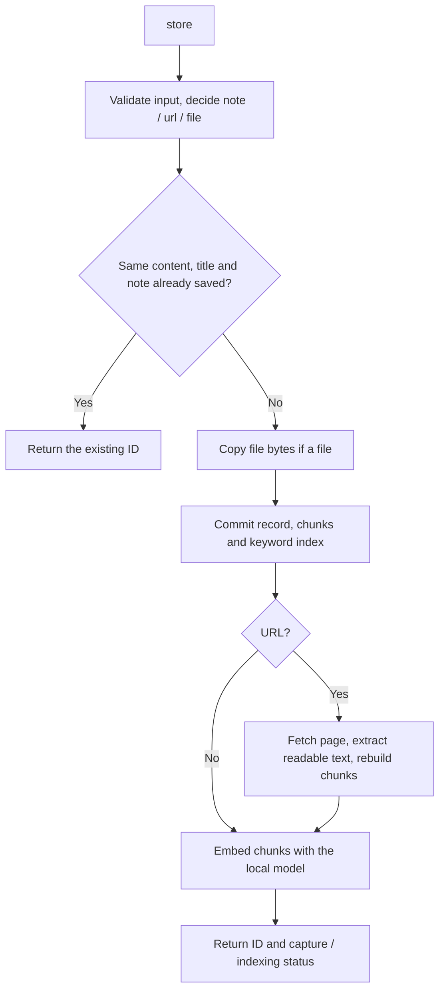
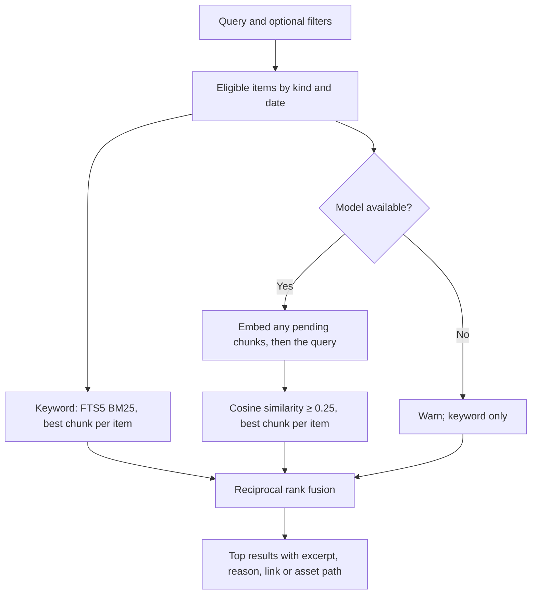

# How Memlio stores and finds memories

This describes the current implementation. For commands and setup see the [README](../README.md) and [SETUP](SETUP.md); for the reasoning behind the design see [ARCHITECTURE](ARCHITECTURE.md).

The CLI and the MCP server call the same `Memory` class. The agent (Claude Code, Codex, or Copilot CLI) adds the reasoning around the tools; Memlio itself does not run a language model beyond the small embedding model.

## Saving

```sh
memlio store https://example.com/article --note "Useful for my background-job project"
```



**Input kinds.** `http(s)://` is a URL. An absolute path, `./path`, or `../path` is a file; a bare filename needs `--kind file`. Anything else is a note; `--kind note` forces literal text that happens to look like a URL.

**Duplicates.** The kind, the content (file bytes for files), title, note, and description are hashed. An exact repeat returns the existing ID. A different note makes a second record.

**Originals first.** The record, its chunks, and the keyword index are committed before any network request or model inference. Page capture and embedding then update the record. A failure in either step is written to the record as `captureError` or `indexError`; the original is never lost.

**Page capture.** HTTP(S) only, public addresses only (checked per redirect and pinned to the connection), 20-second deadline, five redirects, 5 MB. Readable text is extracted with Readability and converted to Markdown. No scripts run. Pages behind logins, JavaScript rendering, or bot challenges are saved as bookmarks with an error; your note keeps them searchable.

**Files.** Regular files up to 20 MB are copied into `assets/` under their content hash. Text is extracted from `.txt`, `.md`, `.csv`, and `.json`. Other files, including images and PDFs, rely on the description and note.

**Clipboard images.** An image pasted into an agent conversation is sent to the model inline; no file exists and the model cannot pass the bytes to a tool. The server therefore reads the system clipboard itself when `memlio_store` is called with `clipboard: true` (or `memlio store --clipboard`). macOS converts the clipboard image to PNG through AppleScript, Linux uses `wl-paste` or `xclip`, Windows uses PowerShell. The bytes are stored like any file, under `assets/` by content hash with a `.png` extension, titled `Pasted image <time>` unless a title is given. The MCP result carries the image's width, height and size and, for a new item up to 3 MB, the image itself (`echoed: true`), so the agent can confirm it saved what the user pasted rather than something copied later. `memlio_get` reports no `original` for these items; the bytes live at `assetPath`.

## Chunks

The searchable body (note text, extracted page text, or file text) is cut into slices of 900 characters advancing by 750, so neighbours overlap by 150. Each slice is prefixed with the title, note, description, and URL, capped at 300 characters so the prefix cannot crowd the body out of the model's 512-token window. An empty body still produces one prefix-only chunk, which is how described images and failed bookmarks are found.

Every chunk goes into an SQLite FTS5 table (`porter unicode61` tokenizer) and gets one 384-number vector from `Xenova/all-MiniLM-L6-v2` (quantized, mean pooling, normalized), stored as JSON next to the model identifier. Rebuilding chunks keeps vectors whose text has not changed.

## Finding

```sh
memlio find "that article about handling failed background jobs"
```



**Keyword branch.** The query is lowercased, split into words, stop words are removed, and up to 40 terms are OR-joined for FTS5. BM25 ranks chunks; the best chunk per item is kept.

**Semantic branch.** Any chunk without a current vector is embedded first, so a save that failed to index (for example while offline) heals on the next search. The query is embedded and compared by cosine similarity with every stored vector. Chunks under 0.25 are dropped and the best chunk per item is kept. If the model cannot be loaded, the response carries a warning and `mode: keyword`.

**Fusion.** Each branch produces a ranked list of items. The score is `1/(60 + keyword rank) + 1/(60 + semantic rank)`; a missing branch contributes zero. Positions are combined, never raw BM25 and cosine values. The result is the top `limit` items (default 5, CLI maximum 50, MCP maximum 20) with a 600-character excerpt, the reason for the match, the original URL or the copied file path, and the similarity when there is one. Neither score is a probability.

**Filters.** `--kind` and `--after` / `--before` (inclusive, `YYYY-MM-DD`, compared against the save date in UTC) narrow the eligible items before either branch runs.

## Through an agent

`/memlio find …` in Claude Code or Copilot CLI, or `$memlio find …` in Codex, invokes the installed skill. The skill tells the agent to call `memlio_search`, read promising candidates with `memlio_get` (8,000 characters per call, paginated with `nextOffset`), refine the query if needed, and answer with the original link or file plus excerpts. The agent decides what to inspect; the server never receives the conversation and never generates an answer.

`/memlio store …` calls `memlio_store` with the identified item and the rest of the text as the note. Files must lie inside a folder allowed with `memlio setup <client> --allow-path` or inside a filesystem root reported by the client.

## Maintenance

| Command                    | Effect                                                                                                                                        |
| -------------------------- | --------------------------------------------------------------------------------------------------------------------------------------------- |
| `memlio status`            | Item count, pending or failed captures and embeddings, and the failing items.                                                                 |
| `memlio repair`            | Rebuilds chunks and the keyword index from the records, retries failed page captures, and embeds anything missing. Existing vectors are kept. |
| `memlio export <new-dir>`  | Writes `records.json` and copies of the original files.                                                                                       |
| `memlio import <dir>`      | Restores records and files, rebuilds the keyword index, and embeds if the model is available.                                                 |
| `memlio delete <id> --yes` | Removes the record, its chunks, and its file if no other record shares it.                                                                    |

There is no background worker. Everything happens inside the command or MCP call that triggers it. Two processes may repeat the same enrichment; conditional updates prevent attaching a vector to a chunk whose text changed meanwhile.

## Known limits

- Search scans every vector in JavaScript. Fine for thousands of items, not for hundreds of thousands.
- Chunking is by character count, not by sentence or token.
- The 0.25 similarity floor is not calibrated; "no match" detection needs a realistic evaluation corpus.
- No OCR, no PDF text extraction, no image embeddings, no browser-assisted capture.
- Non-UTF-8 pages are decoded as UTF-8.
